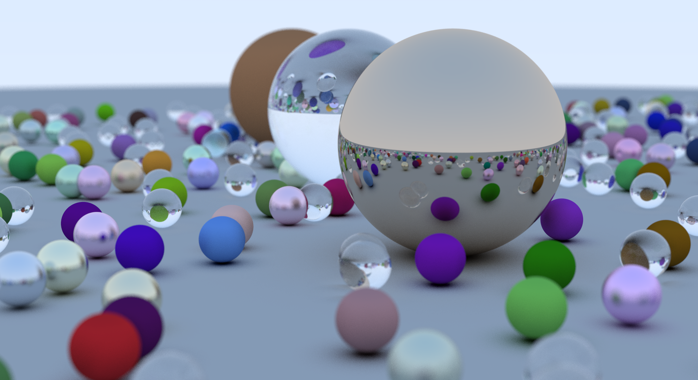

# The Learning Series Of Ray Tracing

This is my Computer Graphics learning repository, and I'm learning this mainly from the book of [*Ray Tracing in One Weekend — The Book Series*](https://raytracing.github.io/). Now I have finished the first book, and the final rendered picture is here: 

*It's really beautiful, although render this picture has cost me almost 4~5 hours (as I used TypeScript not C/C++)*

PLANNING:

- [x] *Ray Tracing in One Weekend* (CPU VERSION)
- [ ] *Ray Tracing in One Weekend* (GPU VERSION)
- [ ] *Ray Tracing: The Next Week*

